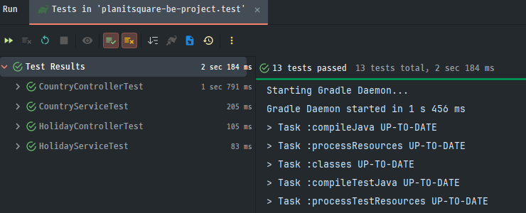
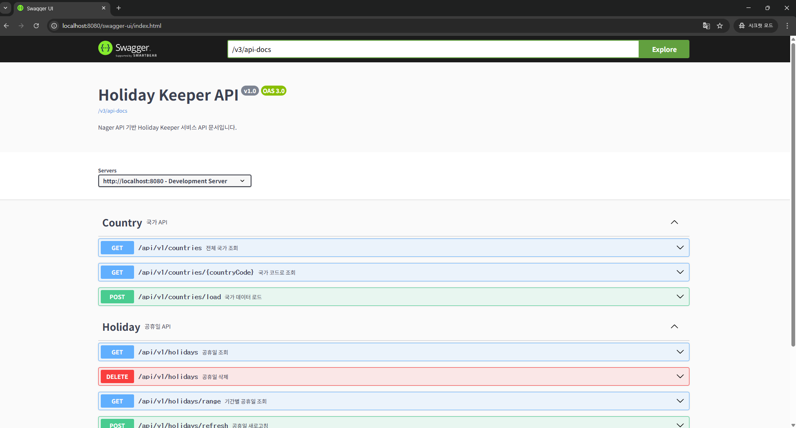
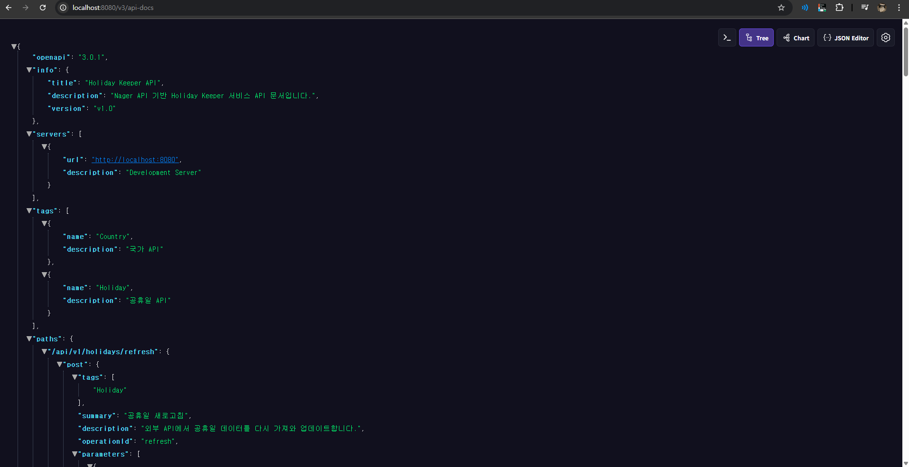

# PlanitSquare proejct 

Nager API 기반 국가별 공휴일 관리 시스템

## 📋 목차
- [프로젝트 개요](#-프로젝트-개요)
- [기술 스택](#-기술-스택)
- [빌드 & 실행 방법](#-빌드--실행-방법)
- [REST API 명세](#-rest-api-명세)
- [테스트 실행](#-테스트-실행)
- [Swagger UI 확인](#-swagger-ui-확인)

## 🎯 프로젝트 개요

외부 API(Nager Date API)를 활용하여 전 세계 국가의 공휴일 정보를 조회하고 관리하는 REST API 서비스입니다.

### 주요 기능
- 국가 정보 조회 및 관리
- 국가별 공휴일 조회
- 기간별 공휴일 검색
- 공휴일 데이터 갱신 및 삭제

## 🛠 기술 스택

| Category | Stack |
|----------|-------|
| Language | Java 21 |
| Framework | Spring Boot 3.4.0 |
| Build Tool | Gradle 8.5 |
| Database | H2 Database (In-Memory) |
| ORM | Spring Data JPA |
| API Documentation | Springdoc OpenAPI 3 (Swagger) |
| Test | JUnit 5 |

## 🚀 빌드 & 실행 방법

### 사전 요구사항
- Java 21 이상
- Gradle 8.5 이상 (또는 프로젝트 내 gradlew 사용)

### 1. 프로젝트 클론
```bash
git clone <repository-url>
cd planitsquare-be-project
```

### 2. 빌드
```bash
# Windows
gradlew clean build

# Mac/Linux
./gradlew clean build
```

### 3. 실행
```bash
# Windows
gradlew bootRun

# Mac/Linux
./gradlew bootRun

# 또는 JAR 파일 직접 실행
java -jar build/libs/planitsquare-be-project-0.0.1-SNAPSHOT.jar
```

### 4. 애플리케이션 접속
- 메인 서버: http://localhost:8080
- Swagger UI: http://localhost:8080/swagger-ui.html
- H2 Console: http://localhost:8080/h2-console
  - JDBC URL: `jdbc:h2:mem:devdb`
  - Username: `sa`
  - Password: (공백)

## 📡 REST API 명세

### Country API

#### 1. 전체 국가 조회
```http
GET /api/v1/countries
```

**응답 예시**
```json
[
  {
    "countryCode": "KR",
    "name": "South Korea"
  },
  {
    "countryCode": "US",
    "name": "United States"
  }
]
```

#### 2. 특정 국가 조회
```http
GET /api/v1/countries/{countryCode}
```

**파라미터**
- `countryCode` (Path): 국가 코드 (예: KR, US, JP)

**응답 예시**
```json
{
  "countryCode": "KR",
  "name": "South Korea"
}
```

#### 3. 국가 데이터 로드
```http
POST /api/v1/countries/load
```

**설명**: 외부 API에서 국가 데이터를 가져와 데이터베이스에 저장합니다.

**응답 예시**
```json
[
  {
    "countryCode": "KR",
    "name": "South Korea"
  }
]
```

### Holiday API

#### 1. 공휴일 조회
```http
GET /api/v1/holidays?year={year}&country={countryCode}
```

**파라미터**
- `year` (Query, Required): 연도 (예: 2024)
- `country` (Query, Required): 국가 코드 (예: KR)

**응답 예시**
```json
[
  {
    "id": 1,
    "year": 2024,
    "countryCode": "KR",
    "date": "2024-01-01",
    "name": "New Year's Day",
    "localName": "신정",
    "type": "Public"
  },
  {
    "id": 2,
    "year": 2024,
    "countryCode": "KR",
    "date": "2024-03-01",
    "name": "Independence Movement Day",
    "localName": "삼일절",
    "type": "Public"
  }
]
```

#### 2. 기간별 공휴일 조회
```http
GET /api/v1/holidays/range?from={startDate}&to={endDate}
```

**파라미터**
- `from` (Query, Required): 시작 날짜 (ISO 8601 형식: yyyy-MM-dd)
- `to` (Query, Required): 종료 날짜 (ISO 8601 형식: yyyy-MM-dd)

**응답 예시**
```json
[
  {
    "id": 1,
    "year": 2024,
    "countryCode": "KR",
    "date": "2024-01-01",
    "name": "New Year's Day",
    "localName": "신정",
    "type": "Public"
  }
]
```

#### 3. 공휴일 새로고침
```http
POST /api/v1/holidays/refresh?year={year}&country={countryCode}
```

**파라미터**
- `year` (Query, Required): 연도
- `country` (Query, Required): 국가 코드

**설명**: 외부 API에서 최신 공휴일 데이터를 가져와 갱신합니다.

**응답 예시**
```json
[
  {
    "id": 1,
    "year": 2024,
    "countryCode": "KR",
    "date": "2024-01-01",
    "name": "New Year's Day",
    "localName": "신정",
    "type": "Public"
  }
]
```

#### 4. 공휴일 삭제
```http
DELETE /api/v1/holidays?year={year}&country={countryCode}
```

**파라미터**
- `year` (Query, Required): 연도
- `country` (Query, Required): 국가 코드


### 에러 응답 형식

모든 에러는 다음과 같은 형식으로 반환됩니다:

```json
{
  "status": 404,
  "error": "Not Found",
  "message": "국가를 찾을 수 없습니다: XX",
  "timestamp": "2024-12-07 10:30:45"
}
```

## 🧪 테스트 실행

### 전체 테스트 실행
```bash
# Windows
gradlew clean test

# Mac/Linux
./gradlew clean test
```

### 테스트 성공 스크린샷

> `./gradlew clean test` 
> 
>
> 결과:
> - CountryServiceTest
> - CountryControllerTest
> - HolidayServiceTest
> - HolidayControllerTest

### 테스트 커버리지 확인
```bash
# IntelliJ IDEA
테스트 우클릭 → Run with Coverage
```

### 테스트 구조
```
src/test/java/
   domain/
   ├── country/
   │   ├── service/       
   │   └── controller/    
   └── holiday/
       ├── service/
       └── controller/
```

## 📚 Swagger UI 확인

### 1. Swagger UI 접속
애플리케이션 실행 후 브라우저에서 접속:
```
http://localhost:8080/swagger-ui.html
```

또는
```
http://localhost:8080/swagger-ui/index.html
```

### 2. OpenAPI JSON 확인
```
http://localhost:8080/v3/api-docs
```

### 3. Swagger UI 스크린샷

> 
>
> 확인 사항:
> - Country API 섹션 표시
> - Holiday API 섹션 표시
> - 각 API의 엔드포인트 및 설명 표시

### 4. API 테스트 방법

Swagger UI에서 직접 API를 테스트할 수 있습니다:

1. 원하는 API 엔드포인트 클릭
2. **"Try it out"** 버튼 클릭
3. 파라미터 입력
4. **"Execute"** 버튼 클릭
5. 응답 확인

### 5. OpenAPI JSON 스크린샷

> 
>
> URL: http://localhost:8080/v3/api-docs
>
> 확인 사항:
> - OpenAPI 3.0 스펙 준수
> - 모든 엔드포인트 정의
> - 스키마 정의 포함


## 📂 프로젝트 구조

```
src/
├── main/
│   ├── java/com/example/planitsquarebeproject/
│   │   ├── domain/
│   │   │   ├── country/           # 국가 도메인
│   │   │   │   ├── controller/
│   │   │   │   ├── dto/
│   │   │   │   ├── entity/
│   │   │   │   ├── exception/
│   │   │   │   ├── repository/
│   │   │   │   └── service/
│   │   │   └── holiday/           # 공휴일 도메인
│   │   │       ├── controller/
│   │   │       ├── dto/
│   │   │       ├── entity/
│   │   │       ├── exception/
│   │   │       ├── repository/
│   │   │       └── service/
│   │   └── global/
│   │       ├── config/            # 설정 (Swagger, Web)
│   │       ├── exception/         # 글로벌 예외 처리
│   │       ├── infrastructure/    # 외부 API 클라이언트
│   │       └── init/             # 초기 데이터 로드
│   └── resources/
│       └── application.yml        # 개발 환경 설정
└── test/
    └── java/com/example/planitsquarebeproject/
        └── domain/                # 단위 테스트

```

## 🔧 주요 기능 설명

### 1. 자동 데이터 초기화
애플리케이션 시작 시 자동으로:
- 전 세계 국가 데이터 로드
- 2020-2025년 공휴일 데이터 로드 (모든 국가)

### 2. 글로벌 예외 처리
- 일관된 에러 응답 형식
- 비즈니스 로직 예외 처리
- 외부 API 호출 예외 처리
- 유효성 검증 예외 처리

### 3. DTO 패턴 적용
- Entity 직접 노출 방지
- API 응답 최적화
- 계층 간 데이터 전달 명확화

### 4. 테스트 코드
- Repository 테스트 (DB 연동)
- Service 테스트 (비즈니스 로직)
- Controller 테스트 (API 검증)
- Integration 테스트 (전체 흐름)

### 5. API 문서화
- Swagger UI 제공
- OpenAPI 3.0 스펙 준수
- 모든 엔드포인트 자동 문서화

## 📝 API 호출 예시

### cURL 명령어

#### 국가 목록 조회
```bash
curl -X GET "http://localhost:8080/api/v1/countries" -H "accept: application/json"
```

#### 특정 국가 조회
```bash
curl -X GET "http://localhost:8080/api/v1/countries/KR" -H "accept: application/json"
```

#### 공휴일 조회
```bash
curl -X GET "http://localhost:8080/api/v1/holidays?year=2024&country=KR" -H "accept: application/json"
```

#### 기간별 공휴일 조회
```bash
curl -X GET "http://localhost:8080/api/v1/holidays/range?from=2024-01-01&to=2024-12-31" -H "accept: application/json"
```

#### 공휴일 새로고침
```bash
curl -X POST "http://localhost:8080/api/v1/holidays/refresh?year=2024&country=KR" -H "accept: application/json"
```

#### 공휴일 삭제
```bash
curl -X DELETE "http://localhost:8080/api/v1/holidays?year=2024&country=KR"
```